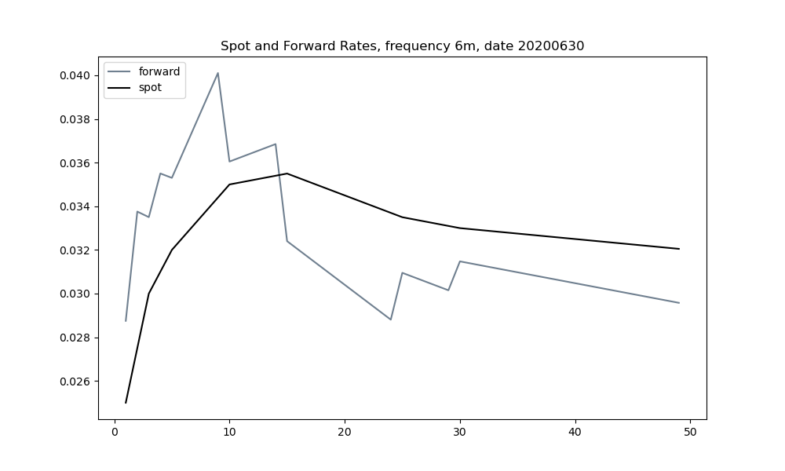

# ForwardCurveAPI
Forward Curve calculation using C# and Python

Example of how C# and Python can be combined to leverage the speed of a complied dll relative to using all Python code but maintaining Python as the interface.  This repository shows an example of creating a dll for a potentially repetitive task of computing a forward curve from a spot curve using the System.Dynamic namespace in Visual Studio and the clr namespace in Python.

